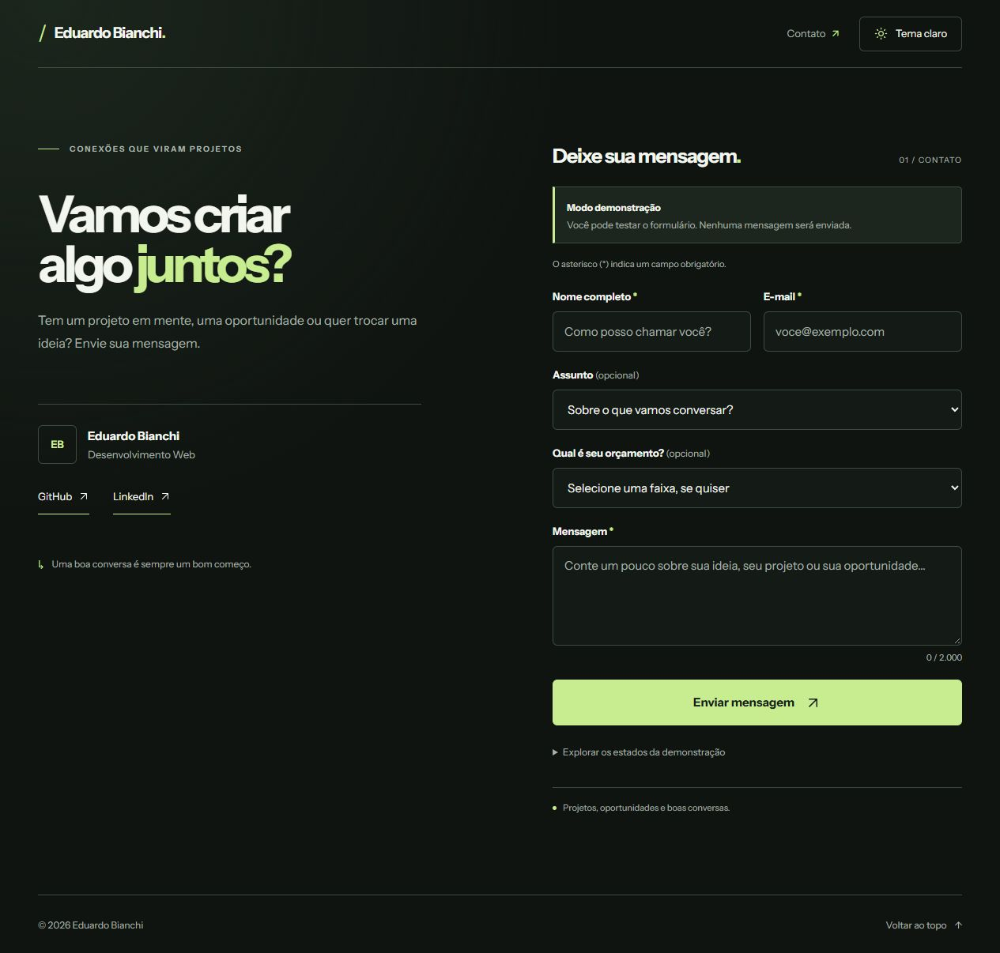

# Forma — página de contato

Página de contato responsiva para o portfólio de **Eduardo Bianchi**, desenvolvida com HTML, CSS e JavaScript. O projeto combina tema escuro e claro, animações com GSAP e um formulário acessível que pode ser ligado a um serviço de envio.



[Ver prévia no tema claro](preview-light.png) · [Ver prévia para celular](preview-mobile.png)

## Recursos

- Apresentação pessoal com links para [GitHub](https://github.com/devEduardoBianchi) e [LinkedIn](https://www.linkedin.com/in/eduardo-bianchi-31bb76321/).
- Alternância entre os temas escuro e claro, com preferência salva no navegador.
- Campos de nome, e-mail, assunto, mensagem e orçamento opcional.
- Validação acessível, mensagens de erro junto aos campos e preservação dos dados após falhas.
- Animações GSAP com suporte à preferência de movimento reduzido.
- Modo de demonstração claro: sem serviço configurado, nenhuma mensagem é enviada.
- Fontes e GSAP incluídos localmente; a página não depende de CDN para funcionar.

## Executar localmente

É necessário ter o [Node.js](https://nodejs.org/) instalado. Na pasta do projeto, execute:

```bash
node server.mjs
```

Abra <http://127.0.0.1:4173> no navegador. Para encerrar a prévia local, pressione `Ctrl+C` no terminal. Também é possível abrir `index.html` diretamente, embora o servidor local represente melhor uma publicação real.

## Personalizar

Edite `config.js` para mudar os dados exibidos na página:

```js
window.CONTACT_CONFIG = {
  profile: {
    name: 'Eduardo Bianchi',
    specialty: 'Desenvolvimento Web',
    github: 'https://github.com/devEduardoBianchi',
    linkedin: 'https://www.linkedin.com/in/eduardo-bianchi-31bb76321/',
  },
  delivery: {
    endpoint: '',
    timeoutMs: 12000,
  },
};
```

O tema e os espaçamentos são definidos pelas variáveis no começo de `style.css`. Os textos e os campos ficam em `index.html`; `DESIGN.md` registra a direção visual do projeto.

## Formulário e envio

Com `delivery.endpoint` vazio, a página fica em modo de demonstração. É possível testar os estados de processamento, sucesso demonstrativo e falha sem enviar dados ou gravá-los no navegador.

Para receber mensagens, configure um endpoint público de formulário, como o fornecido por um serviço de formulários, em `delivery.endpoint`. O navegador envia um `POST` JSON com `name`, `email`, `subject`, `budget` e `message`. A implementação espera uma resposta HTTP de sucesso com JSON `{ "ok": true }`; adapte `deliverMessage` em `script.js` se o serviço escolhido usar outro formato. Consulte também as instruções do provedor antes de publicar.

`config.js` é baixado pelo navegador e faz parte do repositório público. Coloque nele apenas dados públicos e o endereço público do formulário. **Nunca inclua senhas, tokens, chaves privadas ou credenciais de e-mail.** Se a integração exigir uma credencial, envie os dados a uma API de servidor e mantenha a credencial em uma variável de ambiente no servidor. Use HTTPS em produção.

## Arquivos principais

| Arquivo | Função |
| --- | --- |
| `index.html` | Estrutura, conteúdo e campos do formulário. |
| `style.css` | Temas, layout responsivo, foco e estados visuais. |
| `script.js` | Perfil, validação, modo de demonstração e integração de envio. |
| `theme.js` | Alternância de tema e preferência local. |
| `animations.js` | Animações GSAP e respeito a movimento reduzido. |
| `config.js` | Dados públicos do perfil e configuração do endpoint. |
| `server.mjs` | Servidor local para visualizar o projeto. |
| `vendor/gsap.min.js` | Cópia local do GSAP. Créditos e licença em `vendor/README.md`. |
| `assets/fonts/` | Instrument Sans e respectiva licença OFL. |
| `preview*.png` | Capturas da página em desktop, tema claro e celular. |

## Acessibilidade

Os campos têm rótulos sempre visíveis, indicação de obrigatoriedade, foco perceptível e mensagens de validação associadas. A página pode ser usada pelo teclado, anuncia os estados do formulário e respeita a preferência do sistema por movimento reduzido.

## Créditos

O GSAP e a fonte Instrument Sans são distribuídos com seus avisos e licenças nos diretórios correspondentes. Consulte [`vendor/README.md`](vendor/README.md) e [`assets/fonts/InstrumentSans-OFL.txt`](assets/fonts/InstrumentSans-OFL.txt) antes de redistribuir esses arquivos. O código original deste projeto ainda não declara uma licença própria.
